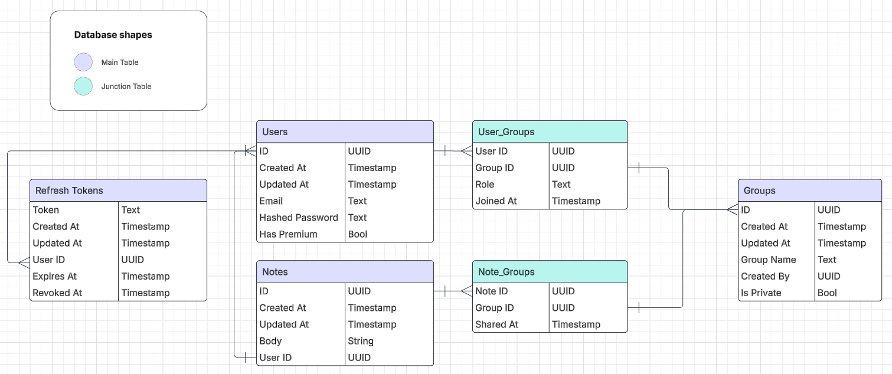

# ZNotes v0.0.1
# API Overview
This API powers a note-taking application, offering endpoints for user authentication, group management, and note management. It uses JSON for data transfer, ensuring a more lightweight and structured communication (compared to XML) between the client and server. Security is managed by  JWT (JSON Web Tokens) and refresh tokens for longer sessions as well as password hashing and user authentication on the tokens for every request (outside of login and registering of course)
This is just the backend of the app as I am no frontend wizard (yet) and like focussing on the business logic much more as that is where my interest lays.

## Database Design Choice
I went with Postgres as I know some SQL and it was a breeze to work with as I used sqlc to generate the Go code based on my entered sql queries(everything related to that is in the './sql/' directory and the sqlc.yaml file)
I originally to only have a table for each stored component (users, groups, notes, and tokens) but had to add junction tables out necesity, as seen below, in order to facilitate and authenticate certain activities such as checking if you can post to a specific group based on if your user id is associated with the group or make querying faster by using a table to look up al the group id's you are associated with instead of storing a csv or similar in each entry of the groups table that contains all the member ids and then having to go through the csv every time to see if you are in the group specified by the targeted group id.

## Database Schema


# API Documentation
# Users and Auth
## Overview
This document outlines the "Users and Auth" API endpoints, detailing their purpose, parameters, responses, and authentication requirements. All request and response data is formatted in JSON for uniformity.

## Endpoints

### Register User
- **URL**: `/api/v1/register`
- **Method**: `POST`
- **Description**: Registers a new user by storing their email and password in the database. The password is hashed before storage, and a unique UUID is assigned to the user.
- **Parameters**:
  - **Request Body** (JSON):
    ```json
    {
      "email": "string",
      "password": "string"
    }
    ```
- **Response**:
  - **Status Codes**:
    - `201 Created`: User successfully registered.
    - `400 Bad Request`: If required fields are missing or the request body is malformed.
    - `424 Failed Dependency`: If password hashing or user creation fails.
  - **Error Responses** (JSON):
    ```json
    {"error": "[something] is required"}
    ```
    ```json
    {"error": "Invalid request body"}
    ```
    ```json
    {"error": "Failed to hash password"}
    ```
    ```json
    {"error": "Failed to create user"}
    ```
- **Authentication**: None required.

### Login User
- **URL**: `/api/v1/login`
- **Method**: `POST`
- **Description**: Authenticates a user by validating their email and password. Upon success, it generates a JWT access token and a refresh token, stores the refresh token in the database, and returns user information along with both tokens.
- **Parameters**:
  - **Request Body** (JSON):
    ```json
    {
      "email": "string",
      "password": "string"
    }
    ```
- **Response**:
  - **Status Codes**:
    - `200 OK`: Successful login.
    - `400 Bad Request`: Invalid request body.
    - `401 Unauthorized`: Invalid credentials.
    - `500 Internal Server Error`: Server-side issues.
  - **Response Body** (JSON):
    ```json
    {
      "id": "uuid",
      "created_at": "timestamp",
      "updated_at": "timestamp",
      "email": "string",
      "token": "string",
      "refresh_token": "string",
      "has_notes_premium": false
    }
    ```
- **Authentication**: None required.

### Logout User
- **URL**: `/api/v1/logout`
- **Method**: `POST`
- **Description**: Invalidates the user's refresh token by removing it from the system. The JWT access token must be provided in the request header.
- **Parameters**: None
- **Response**:
  - **Status Codes**:
    - `204 No Content`: Successfully logged out.
    - `401 Unauthorized`: Invalid or missing JWT.
    - `500 Internal Server Error`: Database failures.
- **Authentication**: Requires a valid JWT in the `Authorization` header.

### Refresh Token
- **URL**: `/api/v1/token/refresh`
- **Method**: `POST`
- **Description**: Generates a new JWT access token using a valid refresh token, which must be provided in the request header. The refresh token is verified for existence, revocation, and expiration before issuing a new access token.
- **Parameters**: None
- **Response**:
  - **Status Codes**:
    - `200 OK`: New access token generated.
    - `401 Unauthorized`: Invalid, revoked, or expired refresh token.
    - `500 Internal Server Error`: Server-side issues.
  - **Response Body** (JSON):
    ```json
    {
      "token": "string"
    }
    ```
- **Authentication**: Requires a valid refresh token in the `Authorization` header.

### Update User
- **URL**: `/api/v1/user/me`
- **Method**: `PUT`
- **Description**: Updates the authenticated user's email and password. The request must include a valid JWT in the header. The new password is hashed before storage, and updated user details are returned.
- **Parameters**:
  - **Request Body** (JSON):
    ```json
    {
      "email": "string",
      "password": "string"
    }
    ```
- **Response**:
  - **Status Codes**:
    - `200 OK`: User information updated successfully.
    - `400 Bad Request`: Invalid request body.
    - `401 Unauthorized`: Invalid or missing JWT.
    - `500 Internal Server Error`: Database issues.
  - **Response Body** (JSON):
    ```json
    {
      "id": "uuid",
      "created_at": "timestamp",
      "updated_at": "timestamp",
      "email": "string",
      "has_notes_premium": false
    }
    ```
- **Authentication**: Requires a valid JWT in the `Authorization` header.

# Private Notes
## Overview
This document outlines the "Notes" API endpoints, detailing their purpose, parameters, responses, and authentication requirements. All request and response data is formatted in JSON for uniformity.

## Endpoints

### Update Note
- **URL**: `/api/v1/notes/{noteID}`
- **Method**: `PUT`
- **Description**: Updates the content of a specific note after verifying ownership. Authenticates the user, validates the note ID and ownership, retrieves the existing note, replaces its content with the new body text, and updates the database record.
- **Parameters**:
  - **Path Parameters**: `noteID` (UUID)
  - **Request Body** (JSON):
    ```json
    {
      "noteID": "uuid",
      "body": "string"
    }
    ```
- **Response**:
  - **Status Codes**:
    - `204 No Content`: Note updated successfully.
- **Authentication**: Requires a valid JWT in the `Authorization` header.

### Delete Note
- **URL**: `/api/v1/notes/{noteID}`
- **Method**: `DELETE`
- **Description**: Deletes a specific note owned by the authenticated user. Validates the user's authentication token, parses the note ID from the path parameters, and removes the note from the database only if it belongs to the requesting user.
- **Parameters**:
  - **Path Parameters**: `noteID` (UUID)
  - **Request Body**: None
- **Response**:
  - **Status Codes**:
    - `204 No Content`: Note deleted successfully.
- **Authentication**: Requires a valid JWT in the `Authorization` header.

### Get Note
- **URL**: `/api/v1/notes/{noteID}`
- **Method**: `GET`
- **Description**: Retrieves a specific note by ID for the authenticated user. Validates the note ID from path parameters, authenticates the user, verifies ownership of the note, retrieves the note data from the database, and returns the complete note object.
- **Parameters**:
  - **Path Parameters**: `noteID` (UUID)
  - **Request Body**: None
- **Response**:
  - **Status Codes**:
    - `200 OK`: Note retrieved successfully.
  - **Response Body** (JSON):
    ```json
    {
      "id": "uuid",
      "created_at": "timestamp",
      "updated_at": "timestamp",
      "body": "string",
      "user_id": "uuid"
    }
    ```
- **Authentication**: Requires a valid JWT in the `Authorization` header.

### Get Notes by Author
- **URL**: `/api/v1/notes`
- **Method**: `GET`
- **Description**: Retrieves all notes for a specific author ID. Parses the author ID from query parameters, validates it's not empty, fetches all notes associated with that author from the database, and returns them as an array of note objects.
- **Parameters**:
  - **Query Parameters**: `authorId` (UUID)
  - **Request Body**: None
- **Response**:
  - **Status Codes**:
    - `200 OK`: Notes retrieved successfully.
  - **Response Body** (JSON):
    ```json
    [
      {
        "id": "uuid",
        "created_at": "timestamp",
        "updated_at": "timestamp",
        "body": "string",
        "user_id": "uuid"
      },
      ...
    ]
    ```
- **Authentication**: None required.

### Create Note
- **URL**: `/api/v1/notes`
- **Method**: `POST`
- **Description**: Creates a new note for an authenticated user. Decodes the request body, authenticates the user via token, verifies the requested user ID matches the authenticated user, creates a new note record in the database with the provided content, and assigns it to the specified user.
- **Parameters**:
  - **Request Body** (JSON):
    ```json
    {
      "body": "string",
      "user_id": "uuid"
    }
    ```
- **Response**:
  - **Status Codes**:
    - `201 Created`: Note created successfully.
- **Authentication**: Requires a valid JWT in the `Authorization` header.

# Teams
## Overview
This section details the "Teams" API endpoints, which manage team-related operations such as creation, retrieval, deletion, and membership management. All requests and responses use JSON for consistency.

## Endpoints

### Create Team
- **URL**: `/api/v1/teams`
- **Method**: `POST`
- **Description**: Creates a new team with a specified name, creator (via user ID), and privacy setting.
- **Parameters**:
  - **Request Body** (JSON):
    ```json
    {
      "team_name": "string",
      "user_id": "uuid",
      "is_private": "bool"
    }
    ```
- **Response**:
  - **Status Codes**:
    - `201 Created`: Team successfully created.
    - `406 Not Acceptable`: If `team_name` is missing.
    - `500 Internal Server Error`: If there’s an error decoding the request or creating the team.
  - **Error Responses** (JSON):
    ```json
    {"error": "Please enter a team name"}
    ```
    ```json
    {"error": "Failed to create team"}
    ```
- **Authentication**: Not explicitly required in the code, though it may be intended to require a valid JWT for the creator.

### Get All Teams
- **URL**: `/api/v1/teams`
- **Method**: `GET`
- **Description**: Retrieves all teams associated with the authenticated user.
- **Parameters**: None
- **Response**:
  - **Status Codes**:
    - `200 OK`: Successfully retrieved teams.
    - `400 Bad Request`: If authentication fails.
    - `403 Forbidden`: If there’s an error retrieving teams (e.g., permissions issue).
    - `424 Failed Dependency`: If there’s an error marshaling the response.
    - `502 Bad Gateway`: If there’s an error writing the response.
  - **Response Body** (JSON):
    ```json
    [
      {
        "team_id": "uuid",
        "created_at": "timestamp",
        "updated_at": "timestamp",
        "team_name": "string",
        "created_by": "uuid",
        "is_private": "bool"
      },
      ...
    ]
    ```
- **Authentication**: Requires a valid JWT in the `Authorization` header.

### Get Team by ID
- **URL**: `/api/v1/teams/{teamID}`
- **Method**: `GET`
- **Description**: Retrieves details of a specific team by its ID, if the authenticated user has access.
- **Parameters**:
  - **Query Parameters**: `team_id` (UUID)
- **Response**:
  - **Status Codes**:
    - `200 OK`: Successfully retrieved the team.
    - `400 Bad Request`: If the team ID is invalid or authentication fails.
    - `502 Bad Gateway`: If there’s an error retrieving the team or writing the response.
    - `424 Failed Dependency`: If there’s an error marshaling the response.
  - **Response Body** (JSON):
    ```json
    {
      "team_id": "uuid",
      "created_at": "timestamp",
      "updated_at": "timestamp",
      "team_name": "string",
      "created_by": "uuid",
      "is_private": "bool"
    }
    ```
- **Authentication**: Requires a valid JWT in the `Authorization` header.

### Delete Team
- **URL**: `/api/v1/teams/{teamID}`
- **Method**: `DELETE`
- **Description**: Deletes a specific team by its ID, if the authenticated user has the authority (e.g., creator or admin).
- **Parameters**:
  - **Query Parameters**: `team_id` (UUID)
- **Response**:
  - **Status Codes**:
    - `204 No Content`: Team successfully deleted.
    - `400 Bad Request`: If the team ID is invalid or authentication fails.
    - `424 Failed Dependency`: If there’s an error deleting the team.
- **Authentication**: Requires a valid JWT in the `Authorization` header.

### Add User to Team
- **URL**: `/api/v1/teams/{teamID}/members`
- **Method**: `POST`
- **Description**: Adds a user to a team with a specified role, if the authenticated user is an admin of the team.
- **Parameters**:
  - **Query Parameters**: `team_id` (UUID)
  - **Request Body** (JSON):
    ```json
    {
      "user_id": "uuid",
      "role": "string"
    }
    ```
- **Response**:
  - **Status Codes**:
    - `204 No Content`: User successfully added.
    - `400 Bad Request`: If authentication fails, team ID is invalid, requester isn’t an admin, or there’s an error adding the user.
  - **Error Responses** (JSON):
    ```json
    {"error": "You are not authorized to add people to this group"}
    ```
- **Authentication**: Requires a valid JWT in the `Authorization` header.

### Remove User from Team
- **URL**: `/api/v1/teams/{teamID}/members/{memberID}`
- **Method**: `DELETE`
- **Description**: Removes a user from a team, if the authenticated user is an admin of the team.
- **Parameters**:
  - **Query Parameters**: `team_id` (UUID), `memberID` (UUID)
- **Response**:
  - **Status Codes**:
    - `204 No Content`: User successfully removed.
    - `400 Bad Request`: If authentication fails, IDs are invalid, requester isn’t an admin, or there’s an error removing the user.
  - **Error Responses** (JSON):
    ```json
    {"error": "You are not authorized to add people to this group"}
    ```
- **Authentication**: Requires a valid JWT in the `Authorization` header.

### Get Team Members
- **URL**: `/api/v1/teams/{teamID}/members`
- **Method**: `GET`
- **Description**: Retrieves all members of a specific team, if the authenticated user is a member of the team.
- **Parameters**:
  - **Query Parameters**: `team_id` (UUID)
- **Response**:
  - **Status Codes**:
    - `200 OK`: Successfully retrieved members.
    - `400 Bad Request`: If authentication fails, team ID is invalid, requester isn’t a member, or there’s an error retrieving members.
    - `424 Failed Dependency`: If there’s an error marshaling the response.
    - `502 Bad Gateway`: If there’s an error writing the response.
  - **Response Body** (JSON):
    ```json
    [
      {
        "user_id": "uuid",
        "team_id": "uuid",
        "role": "string"
      },
      ...
    ]
    ```
    *Note*: The code suggests `[]database.Team`, but it’s likely intended to return team members (e.g., `[]database.UserTeam`).
- **Authentication**: Requires a valid JWT in the `Authorization` header.

# Team Notes
## Overview
This section details the "Team Notes" API endpoints, which manage notes associated with teams. These endpoints allow for creating, retrieving, updating, and deleting notes within a team context. All requests and responses use JSON for consistency.

## Endpoints

### Create Team Note
- **URL**: `/api/v1/teams/{teamID}/notes`
- **Method**: `POST`
- **Description**: Creates a new note for the specified team.
- **Parameters**:
  - **Path Parameters**: `teamID` (UUID)
  - **Request Body** (JSON):
    ```json
    {
      "body": "string",
      "user_id": "uuid"
    }
    ```
- **Response**:
  - **Status Codes**:
    - `201 Created`: Note successfully created.
    - `400 Bad Request`: If authentication fails or `teamID` is invalid.
    - `500 Internal Server Error`: If there’s an error decoding the request or creating the note.
  - **Error Responses** (JSON):
    ```json
    {"error": "Failed to create note"}
    ```
- **Authentication**: Requires a valid JWT in the `Authorization` header.

### Get All Team Notes
- **URL**: `/api/v1/teams/{teamID}/notes`
- **Method**: `GET`
- **Description**: Retrieves all notes for the specified team.
- **Parameters**:
  - **Path Parameters**: `teamID` (UUID)
- **Response**:
  - **Status Codes**:
    - `200 OK`: Successfully retrieved notes.
    - `400 Bad Request`: If authentication fails or `teamID` is invalid.
    - `424 Failed Dependency`: If there’s an error retrieving notes.
    - `502 Bad Gateway`: If there’s an error writing the response.
  - **Response Body** (JSON):
    ```json
    [
      {
        "note_id": "uuid",
        "created_at": "timestamp",
        "updated_at": "timestamp",
        "body": "string",
        "user_id": "uuid"
      }
    ]
    ```
- **Authentication**: Requires a valid JWT in the `Authorization` header.

### Get Team Note by ID
- **URL**: `/api/v1/teams/{teamID}/notes/{noteID}`
- **Method**: `GET`
- **Description**: Retrieves a specific note for the specified team by its ID.
- **Parameters**:
  - **Path Parameters**: `teamID` (UUID), `noteID` (UUID)
- **Response**:
  - **Status Codes**:
    - `200 OK`: Successfully retrieved the note.
    - `400 Bad Request`: If authentication fails, `teamID` or `noteID` is invalid, or the user doesn’t have access.
    - `424 Failed Dependency`: If there’s an error marshaling the response.
    - `502 Bad Gateway`: If there’s an error writing the response.
  - **Response Body** (JSON):
    ```json
    {
      "note_id": "uuid",
      "created_at": "timestamp",
      "updated_at": "timestamp",
      "body": "string",
      "user_id": "uuid"
    }
    ```
- **Authentication**: Requires a valid JWT in the `Authorization` header.

### Update Team Note
- **URL**: `/api/v1/teams/{teamID}/notes/{noteID}`
- **Method**: `PUT`
- **Description**: Updates the body of a specific note for the specified team.
- **Parameters**:
  - **Path Parameters**: `teamID` (UUID), `noteID` (UUID)
  - **Request Body** (JSON):
    ```json
    {
      "body": "string"
    }
    ```
- **Response**:
  - **Status Codes**:
    - `204 No Content`: Note successfully updated.
    - `400 Bad Request`: If authentication fails, `teamID` or `noteID` is invalid, or the user doesn’t have permission.
    - `500 Internal Server Error`: If there’s an error decoding the request.
    - `424 Failed Dependency`: If there’s an error updating the note.
  - **Error Responses** (JSON):
    ```json
    {"error": "error message"}
    ```
- **Authentication**: Requires a valid JWT in the `Authorization` header.

### Delete Team Note
- **URL**: `/api/v1/teams/{teamID}/notes/{noteID}`
- **Method**: `DELETE`
- **Description**: Deletes a specific note from the specified team and database.
- **Parameters**:
  - **Path Parameters**: `teamID` (UUID), `noteID` (UUID)
- **Response**:
  - **Status Codes**:
    - `204 No Content`: Note successfully deleted.
    - `400 Bad Request`: If authentication fails, `noteID` is invalid, or the user doesn’t have permission.
- **Authentication**: Requires a valid JWT in the `Authorization` header.
